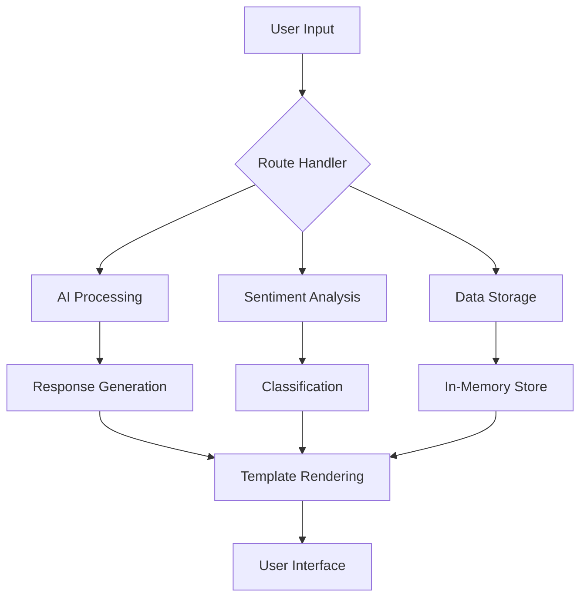

# 📚 CitizenAI Documentation

Welcome to the comprehensive documentation for the **CitizenAI** intelligent citizen engagement platform.

## 📖 Documentation Overview

This documentation covers all aspects of the CitizenAI project, from setup and installation to deployment and maintenance.

---

## 🗂️ Documentation Structure

### 🚀 **Getting Started**
- **[📋 Setup Guide](SETUP.md)** - Complete installation and configuration instructions
- **[🏗️ Build Progress](BUILD_PROGRESS.md)** - Detailed project development timeline and milestones

### 🔧 **Technical Documentation**
- **[� Deployment Guide](DEPLOYMENT.md)** - Production deployment and scaling instructions
- **[🔧 API Reference](API_REFERENCE.md)** - Complete backend API documentation
- **[�🐛 Dashboard Fixes](DASHBOARD_FIXES.md)** - Dashboard error resolution and improvements
- **[📁 Project Structure](#project-structure)** - Overview of project organization

### 📊 **Features & Functionality**
- **[🤖 AI Integration](#ai-integration)** - IBM Granite model implementation
- **[🧠 Sentiment Analysis](#sentiment-analysis)** - Real-time feedback processing
- **[📈 Analytics Dashboard](#analytics-dashboard)** - Data visualization and insights
- **[⚠️ Concern Reporting](#concern-reporting)** - Issue tracking system

---

## 🏗️ Project Structure

```
CitizenAI/
├── 📁 docs/                    # Documentation files
│   ├── README.md              # This file
│   ├── SETUP.md               # Installation guide
│   ├── BUILD_PROGRESS.md      # Development timeline
│   └── DASHBOARD_FIXES.md     # Technical fixes
├── 📁 templates/              # HTML templates
│   ├── index.html             # Landing page
│   ├── login.html             # Authentication
│   ├── chat.html              # AI interaction
│   ├── dashboard.html         # Analytics
│   ├── about.html             # Project info
│   └── services.html          # Services overview
├── 📁 static/                 # Static assets
│   ├── css/styles.css         # Main stylesheet
│   ├── Images/                # Image assets
│   └── Favicon/               # Favicon files
├── 📄 app.py                  # Main Flask application
├── 📄 app_demo.py             # Demo version
├── 📄 requirements.txt        # Python dependencies
└── 📄 README.md               # Project overview
```

---

## 🔗 API Documentation

### 🛣️ **Main Routes**

| Route | Method | Description | Authentication |
|-------|--------|-------------|----------------|
| `/` | GET | Landing page | No |
| `/login` | GET/POST | User authentication | No |
| `/logout` | GET | User logout | Yes |
| `/chat` | GET | Chat interface | Yes |
| `/ask` | POST | AI question processing | Yes |
| `/feedback` | POST | Sentiment analysis | Yes |
| `/concern` | POST | Issue reporting | Yes |
| `/dashboard` | GET | Analytics dashboard | Yes |
| `/about` | GET | Project information | No |
| `/services` | GET | Services overview | No |

### 📊 **Data Flow**



---

## 🤖 AI Integration

### **IBM Granite Model**
- **Model**: `ibm-granite/granite-3.0-3b-a800m-instruct`
- **Quantization**: 4-bit for memory efficiency
- **Device Support**: Auto GPU/CPU detection
- **Fallback**: Demo responses when model unavailable

### **Key Features**:
- ✅ Real-time conversation processing
- ✅ Government service context awareness
- ✅ Memory-efficient quantization
- ✅ Graceful error handling

---

## 🧠 Sentiment Analysis

### **Analysis Engine**
- **Classification**: Positive, Neutral, Negative
- **Method**: Keyword-based sentiment scoring
- **Real-time**: Instant feedback processing
- **Aggregation**: Dashboard analytics integration

### **Implementation**:
```python
def analyze_sentiment(text):
    # Keyword-based sentiment classification
    positive_words = ['good', 'great', 'excellent', ...]
    negative_words = ['bad', 'terrible', 'awful', ...]
    # Returns: 'Positive', 'Neutral', or 'Negative'
```

---

## 📈 Analytics Dashboard

### **Visualization Components**
- **📊 Sentiment Chart**: Interactive doughnut chart with Chart.js
- **📈 Engagement Metrics**: Total interactions and trends
- **⚠️ Issue Tracking**: Recent concerns and status
- **💡 Key Insights**: Automated analysis and recommendations

### **Technical Features**:
- ✅ Real-time data updates
- ✅ Responsive design
- ✅ Error handling and no-data states
- ✅ Interactive tooltips with percentages

---

## ⚠️ Concern Reporting

### **Issue Management System**
- **Submission**: Simple text-based reporting
- **Tracking**: Timestamp and status management
- **Dashboard Integration**: Real-time issue display
- **Status Types**: Open, In Progress, Resolved

### **Data Structure**:
```python
concern_entry = {
    'timestamp': '2025-06-29 14:30:00',
    'text': 'User concern description',
    'status': 'Open'
}
```

---

## 🚀 Quick Start Guide

### **1. Installation**
```bash
# Install dependencies
pip install -r requirements.txt

# Run demo version
python app_demo.py

# Or run full AI version
python app.py
```

### **2. Access Application**
- **URL**: http://localhost:5000
- **Demo Login**: admin / password
- **Features**: All functionality available

### **3. Next Steps**
1. Explore the chat interface
2. Submit feedback for sentiment analysis
3. Report concerns to test tracking
4. View analytics on the dashboard

---

## 🔧 Development & Deployment

### **Development Environment**
- **Python**: 3.11+
- **Framework**: Flask 3.0+
- **AI Libraries**: PyTorch, Transformers
- **Frontend**: HTML5, CSS3, Chart.js

### **Production Considerations**
- **Database**: Replace in-memory storage
- **Security**: Environment variables, CSRF protection
- **Performance**: Caching, load balancing
- **Deployment**: Docker, cloud platforms

---

## 📞 Support & Contributing

### **Getting Help**
- Check the [Setup Guide](SETUP.md) for installation issues
- Review [Dashboard Fixes](DASHBOARD_FIXES.md) for technical problems
- See [Build Progress](BUILD_PROGRESS.md) for development timeline

### **Contributing**
1. Fork the repository
2. Create a feature branch
3. Follow the existing code structure
4. Update documentation as needed
5. Submit a pull request

---

## 📝 License & Acknowledgments

### **License**
This project is licensed under the terms specified in the LICENSE file.

### **Technologies Used**
- **Backend**: Flask, Python
- **AI/ML**: IBM Granite, PyTorch, Transformers
- **Frontend**: HTML5, CSS3, JavaScript
- **Charts**: Chart.js
- **Styling**: Custom CSS with modern gradients

### **Acknowledgments**
- IBM for the Granite language model
- Flask community for the web framework
- Chart.js for visualization capabilities

---

*Last Updated: June 29, 2025*  
*CitizenAI - Empowering Citizens Through AI* 🚀
